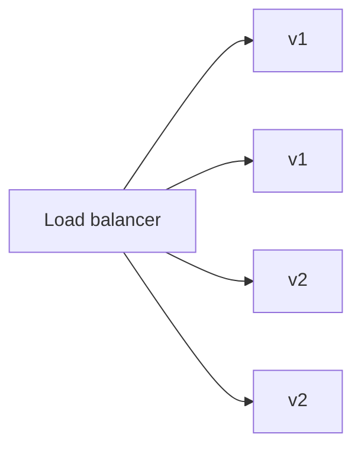
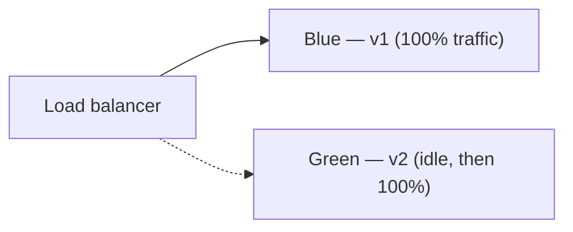
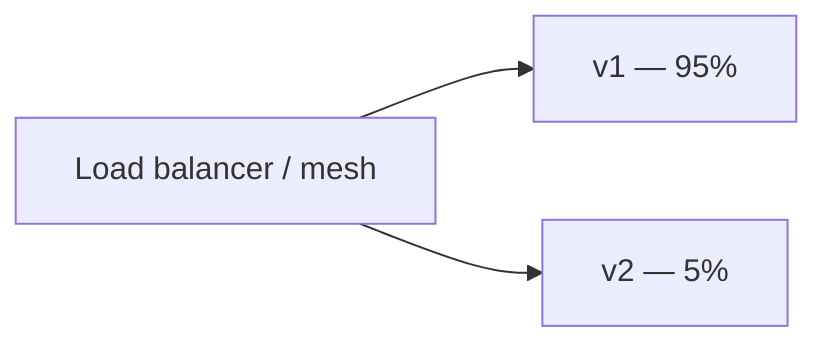

# Deployment Strategies

#infrastructure

Ways to get a new version running in production **without taking everything down at once**. Applies whether you ship a Docker image or a traditional artifact.

Parent: [Deployment & Release Engineering](../deployment-and-release-engineering.md)

---
## Build once, deploy many

Before strategy details — the unit you deploy is always a **built artifact**:

| | Docker | Traditional (EC2) |
|---|--------|-------------------|
| **Artifact** | Image tag | JAR, `dist/` tarball, binary |
| **Built in** | CI (`docker build`) | CI (`mvn package`, `npm run compile`) |
| **Stored in** | ECR | S3, Artifactory |
| **Deployed by** | Update task definition / Deployment → new tag | Copy file + restart process |

Same pipeline shape; different packaging. See [Docker — Local vs Production](../../technologies/docker.md#local-vs-production).

---
## Rolling deployment

Replace instances **gradually** — old and new versions run side by side during rollout.

1. Start new tasks/instances with v2
2. Wait for health checks to pass
3. Drain and stop old v1 tasks
4. Repeat until all replicas are v2

| Pros | Cons |
|------|------|
| Simple, default on ECS/K8s | Two versions live at once — schema/API must be compatible |
| No extra infrastructure | Slow rollback if you don't keep old image tag |
| | Harder to test v2 on a tiny slice first |

**ECS:** service update with `minimumHealthyPercent` / `maximumPercent`  
**K8s:** Deployment `maxSurge` / `maxUnavailable`  
**EC2 + ALB:** register new instances, deregister old ones in batches

---
## Blue / green

Two **full environments**. Traffic switches atomically (or near-atomically) from blue (current) to green (new).

1. Deploy v2 to green (no production traffic)
2. Smoke-test green directly
3. Switch LB target group / DNS to green
4. Keep blue warm for fast rollback (switch back)

| Pros | Cons |
|------|------|
| Instant cutover | 2× resources during deploy (cost) |
| Fast rollback = flip traffic back | DB migrations tricky if blue/green share one DB |
| Clean testing of full stack before switch | |

---
## Canary

Route a **small percentage** of traffic to the new version. Increase gradually if metrics look good.

1. Deploy v2 with 5% traffic
2. Watch error rate, latency, business metrics
3. Ramp to 25% → 50% → 100%
4. Abort and rollback if canary fails

| Pros | Cons |
|------|------|
| Smallest blast radius | Needs traffic splitting (ALB weighted targets, Istio, LaunchDarkly, etc.) |
| Real production signal before full rollout | More operational complexity |

Often combined with [feature flags](feature-flags.md) for app-level control.

---
## Recreate (big-bang)

Stop all old, start all new. Simple but **downtime** during the gap.

Rare for user-facing APIs; sometimes OK for batch workers or internal tools.

---
## Choosing a strategy

| Situation | Typical choice |
|-----------|----------------|
| Default API on ECS/EKS | Rolling |
| Need instant rollback, can afford 2× capacity | Blue/green |
| High risk change, strong metrics | Canary |
| Internal job, downtime OK | Recreate |

---
## Compatibility during rollout

With rolling or canary, **old and new code run simultaneously**. Plan for:

- **Backward-compatible API changes** — add fields, don't remove/rename in one deploy
- **Database migrations** — expand/contract pattern; avoid breaking old code on shared schema
- **Kafka/events** — consumers on different versions may process the same topic

Pair breaking changes with [feature flags](feature-flags.md) or a two-phase deploy.

---
