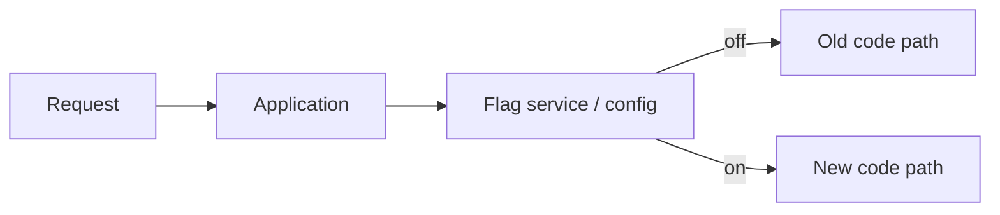

# Feature Flags

#infrastructure

A **feature flag** (feature toggle) decouples **deploying code** from **exposing behaviour** to users. Code ships to production disabled; you enable it when ready — without a second deploy.

Parent: [Deployment & Release Engineering](../deployment-and-release-engineering.md)

---
## Why use them

| Without flags | With flags |
|---------------|------------|
| Deploy = users see the change | Deploy = code present but off |
| Rollback = redeploy old version | Rollback = flip flag off (seconds) |
| Long-lived branches for big features | Trunk-based development; merge small, flag-gated |

Flags complement [deployment strategies](deployment-strategies.md) — e.g. canary at the infra layer, flag at the feature layer.

---
## Common types

| Type | Purpose | Example |
|------|---------|---------|
| **Release flag** | Hide incomplete features | New checkout flow off until QA done |
| **Ops / kill switch** | Disable broken path instantly | Turn off recommendations if dependency fails |
| **Experiment / A/B** | Percentage rollout for measurement | 10% of users see new pricing UI |
| **Permission flag** | Entitlement / tier gating | Beta feature for internal users only |

Release and kill switches are the most valuable for backend teams learning infra.

---
## How it works (conceptually)



```typescript
if (flags.isEnabled('new-order-handler', userId)) {
  return newOrderHandler(order);
}
return legacyOrderHandler(order);
```

Flag evaluation can be:

- **In-process** — env var, config file (simple, no dynamic toggles)
- **Hosted service** — LaunchDarkly, Unleash, Flagsmith (dynamic, targeting, audit)
- **DIY** — Redis/DB key, SSM Parameter (fine for small teams)

---
## Patterns

### Ship dark, enable later

1. Merge feature behind flag (default `false`)
2. Deploy to prod — no user impact
3. Enable for internal users / staging tenant
4. Gradual rollout by percentage or region
5. Remove flag and dead code once stable

### Kill switch

Wrap risky integrations or expensive paths:

```typescript
if (!flags.isEnabled('external-credit-check')) {
  return defaultCreditScore();
}
```

Flip off in incident without redeploying.

### Percentage rollout

Hash `userId` → bucket 0–99 → enable if `< rolloutPercentage`. Same user always gets same experience (sticky).

---
## Trade-offs

| Pros | Cons |
|------|------|
| Safer releases, faster rollback of *behaviour* | Flag debt — old flags clutter codebase |
| Trunk-based development | Testing combinatorics (flag on/off × environments) |
| Gradual exposure | Another dependency if using hosted service |

**Rule:** delete flags after full rollout. Treat them as temporary scaffolding, not permanent config.

---
## Flags vs deployment strategies

| Layer | Controls |
|-------|----------|
| **Deployment strategy** (rolling, canary) | Which *version* of the app receives traffic |
| **Feature flag** | Which *code path* runs inside a given version |

You can deploy v2 to 100% of tasks with a new feature still disabled for all users — then enable via flag. That's often safer than a infra-only canary for large feature changes.

---
## Related

- [Rollbacks](rollbacks.md) — flag off is the fastest "rollback" for behaviour; image rollback for broken deploys
- [Deployment Strategies](deployment-strategies.md)

---
