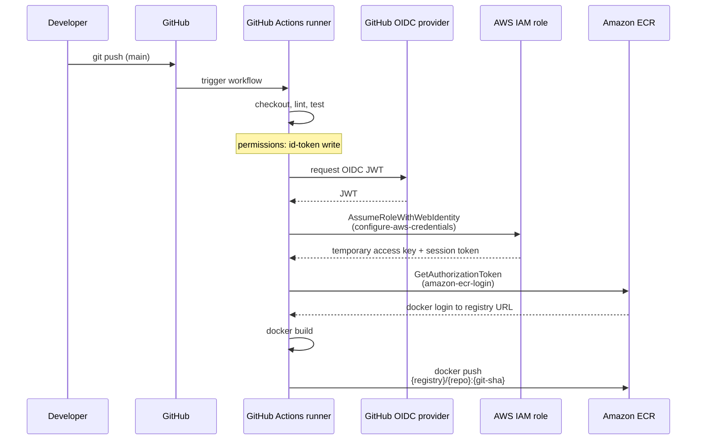

# AWS ECR (Elastic Container Registry)

#technology #aws #docker

Amazon **ECR** is AWS’s managed **container image registry**. It stores, versions, and distributes Docker/OCI images privately within your AWS account — the natural place to land images built in CI before **ECS**, **EKS**, or **Fargate** pull and run them.

Part of the broader AWS container story: [Amazon Web Services](aws.md). Images are run on [ECS](ecs.md), [EKS](eks.md), or [EC2](ec2.md). For image builds, see [Docker](docker.md). For CI push, see [GitHub Actions](github-actions.md).

---

## Resources

- **Deep Dives**
	- [Amazon ECR User Guide](https://docs.aws.amazon.com/AmazonECR/latest/userguide/what-is-ecr.html)
	- [Push a Docker image to ECR](https://docs.aws.amazon.com/AmazonECR/latest/userguide/docker-push-ecr-image.html)
	- [Private image replication](https://docs.aws.amazon.com/AmazonECR/latest/userguide/replication.html)
	- [Lifecycle policies](https://docs.aws.amazon.com/AmazonECR/latest/userguide/Lifecycle.html)
	- [Image scanning](https://docs.aws.amazon.com/AmazonECR/latest/userguide/image-scanning.html)

- **CI/CD & auth**
	- [Configuring OIDC in AWS (GitHub Actions)](https://docs.github.com/en/actions/security-for-github-actions/security-hardening-your-deployments/configuring-openid-connect-in-amazon-web-services)
	- [aws-actions/configure-aws-credentials](https://github.com/aws-actions/configure-aws-credentials)
	- [aws-actions/amazon-ecr-login](https://github.com/aws-actions/amazon-ecr-login)

- **Hands-on**
	- [ECR push via GitHub Actions (OIDC)](hands-on/ecr-github-actions-oidc.md) — full AWS + workflow setup (Showtimex reference)

---

## Core Concepts

- **Registry**  
  One ECR registry per AWS account per region. All repositories in that account/region live under the same registry endpoint.

- **Repository**  
  A named collection of images (like a namespace on Docker Hub). Names can include slashes, e.g. `myapp/api`. Each repository holds many **tags** pointing at the same or different image manifests.

- **Image URI**  
  The address you `docker push` to and that ECS/EKS reference in task definitions:

  ```text
  {account-id}.dkr.ecr.{region}.amazonaws.com/{repository}:{tag}
  ```

  Example: `123456789012.dkr.ecr.eu-central-1.amazonaws.com/showtimex/api:a1b2c3d`

- **Tags vs digests**  
  A **tag** is a mutable (or immutable) label like `latest` or a git SHA. A **digest** (`sha256:…`) is the content-addressable ID of the exact image layers. Prefer **immutable tags** (or digests) in production so a tag always refers to one build.

- **Layers & deduplication**  
  ECR stores images as layers, same as Docker. Identical layers across repositories in a region are stored once — pushes are incremental after the first upload.

- **Region-scoped**  
  ECR is regional. The registry URL, repositories, and images all belong to one region. Cross-region use cases rely on **replication rules** or pulling from the region where the cluster runs.

- **Private by default**  
  Images are private to your account (and principals you grant via IAM or repository policies). **Amazon ECR Public** is a separate, public registry with its own endpoint (`public.ecr.aws`).

- **Integration with compute**  
  ECS task definitions, EKS `Pod` specs, and Lambda container images reference an ECR URI. The compute service pulls the image using execution-role IAM permissions — no long-lived docker credentials on the host when configured correctly.

- **Lifecycle policies**  
  Rules to expire untagged images or keep only the last N tags — controls storage cost without manual cleanup.

- **Scanning**  
  Optional **scan on push** (basic or enhanced via Amazon Inspector) flags CVEs in image layers before deploy.

---

## Authentication & IAM

Clients (your laptop, a CI runner, an EC2 instance) authenticate to ECR in two steps:

1. **AWS credentials** — prove identity to AWS (IAM user keys, instance profile, or **OIDC**-assumed role in GitHub Actions).
2. **Registry login** — call `ecr:GetAuthorizationToken`, then pass the token to `docker login` (valid ~12 hours).

Minimum IAM for push to a single repository:

| Action | Scope |
| --- | --- |
| `ecr:GetAuthorizationToken` | `*` (always account-wide) |
| `ecr:BatchCheckLayerAvailability`, `InitiateLayerUpload`, `UploadLayerPart`, `CompleteLayerUpload`, `PutImage` | `arn:aws:ecr:REGION:ACCOUNT:repository/REPO_NAME` |

Pull-only workloads (ECS execution role, deploy host) need `ecr:BatchGetImage` and `ecr:GetDownloadUrlForLayer` on the target repository.

**Prefer OIDC in CI** over storing `AWS_ACCESS_KEY_ID` / `AWS_SECRET_ACCESS_KEY` in GitHub Secrets: the workflow requests a short-lived token from GitHub, assumes an IAM role via `sts:AssumeRoleWithWebIdentity`, then pushes. Setup details: [ECR push via GitHub Actions (OIDC)](hands-on/ecr-github-actions-oidc.md).

---

## Common CI/CD flow (GitHub Actions → ECR)

Typical pattern on **push to `main`**: run tests, assume an AWS role, log in to ECR, build the Dockerfile, push with an immutable tag (often `${{ github.sha }}`). Deploy to ECS/EC2 is a **separate** step that pulls that URI.



**Workflow shape** (minimal push job):

```yaml
permissions:
  id-token: write   # required for OIDC
  contents: read

steps:
  - uses: actions/checkout@v4

  - uses: aws-actions/configure-aws-credentials@v4
    with:
      role-to-assume: ${{ secrets.AWS_ROLE_ARN }}
      aws-region: ${{ secrets.AWS_REGION }}

  - uses: aws-actions/amazon-ecr-login@v2
    id: ecr-login

  - name: Build and push
    env:
      ECR_REGISTRY: ${{ steps.ecr-login.outputs.registry }}
      ECR_REPOSITORY: myapp/api
      IMAGE_TAG: ${{ github.sha }}
    run: |
      docker build -t $ECR_REGISTRY/$ECR_REPOSITORY:$IMAGE_TAG .
      docker push $ECR_REGISTRY/$ECR_REPOSITORY:$IMAGE_TAG
```

| Step | Action | Purpose |
| --- | --- | --- |
| `configure-aws-credentials` | [aws-actions/configure-aws-credentials](https://github.com/aws-actions/configure-aws-credentials) | Exchange GitHub OIDC token for AWS session credentials via IAM role |
| `amazon-ecr-login` | [aws-actions/amazon-ecr-login](https://github.com/aws-actions/amazon-ecr-login) | Calls `GetAuthorizationToken` and runs `docker login` against your registry |
| `docker build` / `docker push` | Shell on runner | Standard Docker CLI; registry URL comes from `steps.ecr-login.outputs.registry` |

GitHub repo secrets (OIDC path): `AWS_ROLE_ARN`, `AWS_REGION` — no static AWS keys.

---
## Hands-on

- [ECR push via GitHub Actions (OIDC)](hands-on/ecr-github-actions-oidc.md) — OIDC provider, IAM trust policy, scoped ECR permissions, and full workflow (Showtimex).
