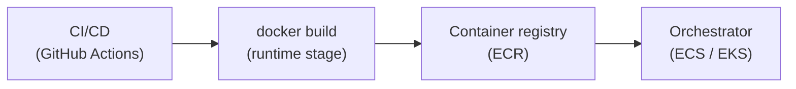

# Docker

Docker enables you to package and run an application in a **container** — a lightweight, portable, and isolated environment. Containers ensure consistency across environments: local dev, CI/CD pipelines, cloud, or production.

---
## Resources

- **Deep Dives**
	- [Dockerfile Reference](https://docs.docker.com/reference/dockerfile/) – Build image instructions
	- [Docker Compose Reference](https://docs.docker.com/compose/) – Multi-container config
	- [Building Images](https://docs.docker.com/get-started/docker-concepts/building-images/)

- **Docs & References** 
	- [Docker Official Docs](https://docs.docker.com/)
	- [Awesome Docker GitHub List](https://github.com/veggiemonk/awesome-docker) – Curated tools, articles, tutorials

---
## Core Concepts

- **Docker Image**  
  A read-only blueprint for a container. Contains:
  - App code
  - System libraries and dependencies
  - Runtime instructions (from a `Dockerfile`)

- **Docker Container**  
  A running instance of an image. It's:
  - Ephemeral (you can create/destroy easily)
  - Isolated (network, filesystem, processes)
  - Portable (runs anywhere Docker is installed in the exact same way)

Typically, each component of your app (e.g., frontend, backend, DB) runs in its own container.

---
## Containers vs Virtual Machines (VMs)

Without getting too deep, a VM is an entire operating system with its own kernel, hardware drivers, programs, and applications. Spinning up a VM only to isolate a single application is a lot of overhead. A container is simply an isolated process with all of the files it needs to run. If you run multiple containers, they all share the same kernel, allowing you to run more applications on less infrastructure.

>  **Bottom line:** Containers are faster, lighter, and more scalable than VMs for most application-level use cases.

---
## Docker Compose

**Docker Compose** defines and runs **multi-container** setups from a YAML file (`docker-compose.yaml`). One command brings up the whole stack:

```bash
docker compose up --build
```

Each `service` block is roughly one container: image (or build context), command, env vars, ports, volumes, and network membership.

Compose is primarily a **local dev and integration** tool — not how most teams run production at scale. It *does* mirror production **topology**: multiple processes (API, workers, Kafka, Postgres), each with its own config, talking over a shared network.

| Compose concept | Production equivalent |
|-----------------|----------------------|
| `services: api:` | ECS service / K8s Deployment |
| `build:` / `image:` | Image from [ECR](aws/services/ecr.md) |
| `command:` | Container command override in task definition / pod spec |
| `environment:` / `env_file:` | Env vars, Secrets Manager, K8s Secrets |
| `ports:` | Load balancer / Ingress |
| `depends_on:` | Startup ordering (prod uses health checks instead) |
| Bind-mounted source (dev) | **Not** used in prod — image is immutable |

Typical local pattern: compose runs **apps + infra** together (API, consumers, Kafka, DB). Same mental model as prod — N services, each with image + command + env — but on one machine with dev conveniences (hot reload, volume mounts).

---
## Local vs Production

### What the Dockerfile produces

A multi-stage `Dockerfile` often has separate targets:

| Stage | Purpose |
|-------|---------|
| `development` | Source + dev deps + `tsx watch` — used by compose locally |
| `runtime` | Compiled output + prod deps only — **what CI builds and ships** |

`docker build .` (no `--target`) builds the **last stage** — usually `runtime`. Compose selects `target: development` for local dev.

The default `CMD` in the image is the **default run command** (e.g. start the API). It can be overridden per service in compose or in production orchestration.

### Production flow: CI → registry → orchestrator

In production, nobody runs `docker compose up` on a server. The usual path:



1. **CI/CD** ([GitHub Actions](github-actions/github-actions.md)) runs on merge or tag: `docker build`, tag with git SHA or semver, push to registry.
2. **Registry** ([ECR](aws/services/ecr.md)) stores immutable image tags. One build artifact, referenced by many services.
3. **Orchestrator** ([ECS](aws/services/ecs.md) or [EKS](aws/services/eks.md)) pulls the image and runs containers with per-service config: command, env, replicas, load balancer, health checks.

**One image, many services:** a distributed monolith often ships a single image for the API and all consumers. Each ECS service / K8s Deployment uses the same `image:` URI but a different `command` (e.g. `node dist/api/app.js` vs `node dist/consumers/foo/app.js`). Deploy, scale, and roll out each service independently.

### What compose does *not* mirror

- Autoscaling, zero-downtime rollouts, multi-AZ
- Secrets managers (SSM, Secrets Manager, K8s Secrets)
- IAM, VPC, service mesh
- Always the `runtime` image — not dev mounts or `tsx`

Compose rehearses **service topology** locally; ECS/EKS + IaC handle **operations** in prod.

See also: [Deployment & Release Engineering](../../infrastructure/deployment-and-release-engineering.md) for release strategies, rollbacks, and feature flags.

---
## Quick reference

```bash
# Build production image locally (test what CI ships)
docker build -t myapp:local .

# List images (stored in Docker, not your project folder)
docker images

# Run production image
docker run --rm -p 3000:3000 -e PORT=3000 myapp:local

# Local full stack
docker compose up --build
```

The `.` in `docker build` is the **build context** (input files for `COPY`), not where the image is saved. `-t myapp:local` names/tags the image inside Docker's storage.

---
