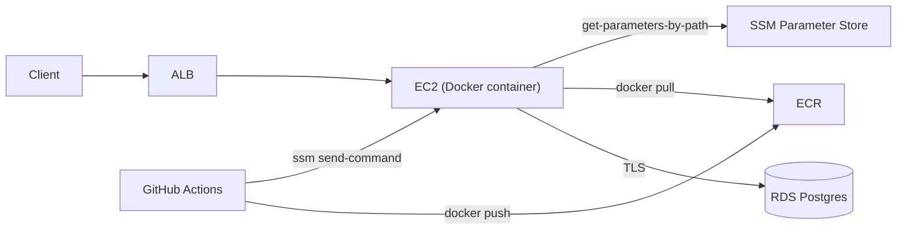
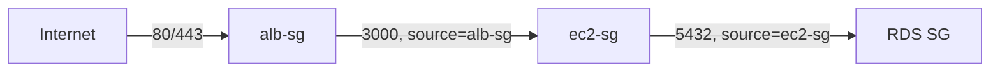

# Case study: Deploy showtimex to EC2 with Docker

#infrastructure #case-study

Reference project: one TypeScript/Express API, one Docker image, one EC2 instance, RDS Postgres.

Pipeline shape: **GitHub Actions → ECR → SSM Run Command → EC2 (Docker) → RDS**.

No ECS, no NAT Gateway — a deliberately minimal, cost-conscious single-instance deploy, built entirely by hand through the console.

**Repo:** https://github.com/vasil-sarandev/showtimex
**Commit snapshot:** 239b2d615cad44e649d73f5b5c6201401d1924e2

---

## Overview



**CI/CD — GitHub Actions → ECR → SSM Run Command:**

- ECR repository `showtimex/api`, immutable tags (no `:latest` — every push tagged only with `${{ github.sha }}`)
- IAM OIDC provider → GitHub (`token.actions.githubusercontent.com`), same provider as any other GitHub Actions AWS role
- **Two separate IAM roles**, deliberately not one — see [Two CI roles, not one](#two-ci-roles-not-one) below
- GitHub secrets: `AWS_ROLE_ARN` (build/push), `AWS_DEPLOY_ROLE_ARN` (SSM deploy), `AWS_REGION`, `EC2_INSTANCE_ID`
- GitHub repo variable: `ENABLE_DEPLOYMENT` — gates `build-and-push-image` (and transitively `deploy`, via `needs`) so the pipeline can lint/test-only without shipping anything

```text
merge to main (ENABLE_DEPLOYMENT=true)
     │
     ├─ lint + test
     ├─ docker build (prod stage) → push to ECR, tagged :{git-sha} only
     └─ deploy: ssm send-command (AWS-RunShellScript) on the EC2 instance
           → runs scripts/deploy-ec2.sh with IMAGE_TAG exported
           → ecr login → docker pull → fetch env from Parameter Store → docker run --restart unless-stopped
```

Unlike the [ECS case study](deploy-to-ecs-node-modulith.md), **push and deploy are two separate jobs that must both succeed** — there's no `update-service` API call that does the "point at the new image" step for you. The deploy job _is_ the mechanism; if it fails partway, the old container is already stopped/removed before the new one starts (see [`scripts/deploy-ec2.sh`](#docker-on-ec2) below), so a failed pull leaves the box with **no** container running, not the old one. Worth knowing going in — this is exactly the kind of gap ECS's `update-service` closes for you.

**Local vs production** — same app code and Dockerfile, very different infrastructure depth:

|              | Local (`docker compose`)                         | Production (EC2)                                                                                                                                           |
| ------------ | ------------------------------------------------ | ---------------------------------------------------------------------------------------------------------------------------------------------------------- |
| **Process**  | `app` + `postgres` as compose services           | Single `showtimex-api` container on one EC2 instance                                                                                                       |
| **Database** | `postgres:17` container, named volume            | Amazon RDS Postgres, TLS-required, private subnet                                                                                                          |
| **Image**    | `dev` stage, bind-mounted source, `tsx watch`    | `prod` stage from ECR, immutable git-SHA tag                                                                                                               |
| **Config**   | `env/.env.local` file                            | [SSM Parameter Store](../../../technologies/aws/services/ssm.md), fetched at container start                                                               |
| **Schema**   | `synchronize: true` (entities → tables directly) | Also `synchronize: true` for this deployment — a deliberate test-only tradeoff; see [Schema: synchronize vs migrations](#schema-synchronize-vs-migrations) |
| **HTTP**     | `localhost:3000`                                 | ALB → target group → EC2:3000                                                                                                                              |
| **Access**   | N/A                                              | SSM Session Manager (no SSH, no open port 22)                                                                                                              |
| **Deploy**   | `npm run dev`                                    | GHA → ECR push → SSM Run Command → `docker run`                                                                                                            |

See [Docker — Local vs Production](../../../technologies/docker/docker.md).

---

## Walkthrough

Built by hand through the console, in this order. Service mechanics for EC2, ALB, RDS, and SSM are covered on their own pages.

### 1. VPC and subnets

Custom VPC via the console's "VPC and more" wizard: 2 AZs, 1 public + 1 private subnet per AZ (4 subnets total).

- EC2 ended up in a **public subnet** with an Elastic IP, not the "textbook" private-subnet-behind-NAT layout
- RDS stayed in a **private subnet**, no public IP, regardless of the EC2 decision — that call was never about NAT/outbound access, it's about RDS never needing to be reachable from outside the VPC at all.

### 2. Security groups

SG-to-SG references, not CIDRs, created in dependency order:



| SG       | Inbound | Source      |
| -------- | ------- | ----------- |
| `alb-sg` | 80, 443 | `0.0.0.0/0` |
| `ec2-sg` | 3000    | `alb-sg`    |
| RDS SG   | 5432    | `ec2-sg`    |

### 3. RDS

PostgreSQL, Single-AZ (not Multi-AZ — the DB subnet group still needs subnets in ≥2 AZs, but only one instance actually runs, so no standby-replica cost), private subnet, no public access.

### 4. IAM — two roles, two very different jobs

**EC2 instance role** (`ec2-ssm-management-role`), attached as an instance profile:

| Policy                                             | Purpose                                                                                                                                                                                                                  |
| -------------------------------------------------- | ------------------------------------------------------------------------------------------------------------------------------------------------------------------------------------------------------------------------ |
| `AmazonSSMManagedInstanceCore` (AWS managed)       | Session Manager + Run Command registration                                                                                                                                                                               |
| `AmazonEC2ContainerRegistryReadOnly` (AWS managed) | `docker pull` from ECR                                                                                                                                                                                                   |
| Inline `showtimex-parameter-store-read`            | `ssm:GetParameter*` on `/showtimex/prod` (both the exact path and `/showtimex/prod/*` — see the [SSM gotcha](../../../technologies/aws/services/ssm.md#gotchas-learned-the-hard-way)) + `kms:Decrypt` on `alias/aws/ssm` |

### 5. EC2 instance + SSM registration

Amazon Linux 2023, `t3.micro` (x86_64 — the GitHub Actions runner building the image is x86_64, so the ECR image is `linux/amd64`; a Graviton/`t4g` instance would silently fail to run it without a multi-arch build). No key pair required — access is exclusively via SSM Session Manager.

Getting `aws ssm start-session` to actually connect took three separate fixes, compounding:

1. **No IAM instance profile at launch.** The EC2 wizard doesn't attach one by default; it has to be explicitly created/selected. Missing this is the #1 cause of `TargetNotConnected`.
2. **No outbound path at all.** The instance was in what looked like a public subnet, but had no public IP assigned (`describe-instances` showed `PublicIpAddress: null`) — a public _subnet_ (route table has an IGW route) doesn't grant a public IP automatically. Fixed by allocating and associating an Elastic IP.
3. **Registration ordering.** Even after both fixes, the agent didn't register — because the instance had already booted (and the agent already tried and failed to register) _before_ the IAM role existed. IAM policy changes apply live to a running instance's credentials, but an agent already in backoff doesn't necessarily retry promptly. A simple instance **reboot** forced a clean re-registration and fixed it immediately.

Docker installed manually over the resulting Session Manager connection:

```bash
sudo dnf install -y docker
sudo systemctl enable --now docker
sudo usermod -aG docker ssm-user   # for interactive sessions; SSM Run Command already runs as root
```

### 6. ALB + target group

Target type **Instance** (not IP — this isn't Fargate), port 3000, health check path `GET /health`. That endpoint didn't exist beforehand and was added as its own component (`system.controller.ts` / `system.router.ts`, mounted unauthenticated at the router root) rather than an inline route, matching the app's existing controller/service layering.

### 7. Docker on EC2

No ECS service, no task definition — a deploy script (`scripts/deploy-ec2.sh`) run via [SSM Run Command](../../../technologies/aws/services/ssm.md#run-command-for-a-cicd-deploy-conceptual) does everything ECS would otherwise automate:

```bash
aws ecr get-login-password --region "$AWS_REGION" | docker login --username AWS --password-stdin "$ECR_REGISTRY"
docker pull "${ECR_REGISTRY}/${ECR_REPOSITORY}:${IMAGE_TAG}"

aws ssm get-parameters-by-path --path "$SSM_PARAM_PATH" --with-decryption \
  --query "Parameters[*].[Name,Value]" --output text \
  | awk -F'\t' -v prefix="${SSM_PARAM_PATH}/" '{name=$1; sub(prefix,"",name); print name"="$2}' > "$ENV_FILE"

docker stop "$CONTAINER_NAME" 2>/dev/null || true
docker rm "$CONTAINER_NAME" 2>/dev/null || true
docker run -d --name "$CONTAINER_NAME" --restart unless-stopped -p 3000:3000 \
  --env-file "$ENV_FILE" "${ECR_REGISTRY}/${ECR_REPOSITORY}:${IMAGE_TAG}"
docker image prune -f
```

CI triggers it via `aws ssm send-command` (document `AWS-RunShellScript`), passing `IMAGE_TAG=${{ github.sha }}` as an exported env line ahead of the script content, then polls `get-command-invocation` for pass/fail. No SSH, no port 22 open — not even transiently for the deploy, unlike an SSH-key-in-GitHub-Secrets approach would require.

---

## Observability

Minimal by design at this stage — no CloudWatch dashboards or alarms set up yet, unlike the [ECS case study](deploy-to-ecs-node-modulith.md#observability)'s. What exists:

| Layer             | Mechanism                                                                                        |
| ----------------- | ------------------------------------------------------------------------------------------------ |
| **Health**        | ALB target group health check on `GET /health`                                                   |
| **Logs**          | `docker logs showtimex-api` over an SSM Session Manager connection — no centralized log shipping |
| **Deploy status** | GitHub Actions job result (`ssm get-command-invocation` status)                                  |

The gap this leaves: a crash-looping container is only visible by manually connecting and checking `docker ps`/`docker logs` — there's no alerting. The natural next step on EC2 without adopting ECS is the CloudWatch Agent shipping container logs and basic host metrics; see [AWS CloudWatch](../../../technologies/aws/services/cloudwatch.md).

---
