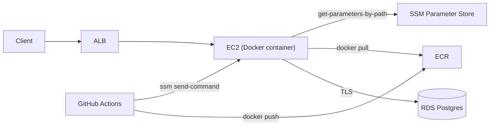
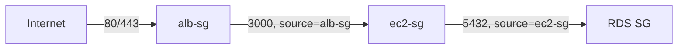

# Case study: Deploy showtimex to EC2 with Docker

#infrastructure #case-study

Reference project: one TypeScript/Express API, one Docker image, one EC2 instance, RDS Postgres. Pipeline shape: **GitHub Actions → ECR → SSM Run Command → EC2 (Docker) → RDS**. No ECS, no NAT Gateway.

**Repo:** https://github.com/vasil-sarandev/showtimex
**Commit snapshot:** 239b2d615cad44e649d73f5b5c6201401d1924e2

---

## Overview



**CI/CD — GitHub Actions → ECR → SSM Run Command:**

- ECR repository `showtimex/api`, immutable tags (no `:latest` — every push tagged only with `${{ github.sha }}`)
- IAM OIDC provider → GitHub (`token.actions.githubusercontent.com`)
- Two IAM roles: `ecr_push_github` (build/push) and `showtimex_deploy_github` (SSM deploy)
- GitHub secrets: `AWS_ROLE_ARN`, `AWS_DEPLOY_ROLE_ARN`, `AWS_REGION`, `EC2_INSTANCE_ID`
- GitHub repo variable: `ENABLE_DEPLOYMENT` — gates `build-and-push-image` (and transitively `deploy`, via `needs`)

```text
merge to main (ENABLE_DEPLOYMENT=true)
     │
     ├─ lint + test
     ├─ docker build (prod stage) → push to ECR, tagged :{git-sha} only
     └─ deploy: ssm send-command (AWS-RunShellScript) on the EC2 instance
           → runs scripts/deploy-ec2.sh with IMAGE_TAG exported
           → ecr login → docker pull → fetch env from Parameter Store → docker run --restart unless-stopped
```

**Local vs production** — same app code and Dockerfile, different infrastructure running it:

| | Local (`docker compose`) | Production (EC2) |
| --- | --- | --- |
| **Process** | `app` + `postgres` as compose services | Single `showtimex-api` container on one EC2 instance |
| **Database** | `postgres:17` container, named volume | Amazon RDS Postgres, TLS required, private subnet |
| **Image** | `dev` stage, bind-mounted source, `tsx watch` | `prod` stage from ECR, immutable git-SHA tag |
| **Config** | `env/.env.local` file | [SSM Parameter Store](../../../technologies/aws/services/ssm.md), fetched at container start |
| **HTTP** | `localhost:3000` | ALB → target group → EC2:3000 |
| **Access** | N/A | SSM Session Manager (no SSH, no open port 22) |
| **Deploy** | `npm run dev` | GHA → ECR push → SSM Run Command → `docker run` |

See [Docker — Local vs Production](../../../technologies/docker/docker.md).

---

## Walkthrough

Built by hand through the console, in this order. General mechanics for EC2, ALB, RDS, and SSM are covered on their own pages ([EC2](../../../technologies/aws/services/ec2.md), [ALB](../../../technologies/aws/services/alb.md), [RDS](../../../technologies/aws/services/rds.md), [SSM](../../../technologies/aws/services/ssm.md)) — this section is the concrete configuration for this specific deployment.

### 1. OIDC + IAM role for GitHub → ECR push

IAM OIDC identity provider for `token.actions.githubusercontent.com`, and an IAM role (`ecr_push_github`) with trust scoped to `repo:vasil-sarandev/showtimex:*`, permissions limited to `ecr:*` on the `showtimex/api` repository.

### 2. GitHub workflow: lint, test, push image

`.github/workflows/ci-cd.yml` — `run-linter` and `run-tests` in parallel, then `build-and-push-image` on push to `main`: assumes `ecr_push_github` via OIDC, builds the Dockerfile's `prod` stage, pushes to ECR tagged with the git SHA only.

### 3. VPC, subnets, and security groups

Custom VPC via the console's "VPC and more" wizard: 2 AZs, 1 public + 1 private subnet per AZ. No NAT Gateway — EC2 sits in a public subnet with an Elastic IP instead; RDS sits in a private subnet with no public IP.

SG-to-SG references, not CIDRs:



| SG | Inbound | Source |
| --- | --- | --- |
| `alb-sg` | 80, 443 | `0.0.0.0/0` |
| `ec2-sg` | 3000 | `alb-sg` |
| RDS SG | 5432 | `ec2-sg` |

### 4. Internet Gateway

Attached to the VPC as part of the same wizard — gives the public subnets (and EC2's Elastic IP) their route to the internet. RDS's private subnet has no route to it.

### 5. EC2 instance + IAM role for SSM

Amazon Linux 2023, `t3.micro`, no key pair. IAM role `ec2-ssm-management-role` attached as an instance profile with `AmazonSSMManagedInstanceCore` — required for the instance to register with Session Manager / Run Command at all.

### 6. SSM into the instance, install Docker

```bash
aws ssm start-session --target <instance-id>

sudo dnf install -y docker
sudo systemctl enable --now docker
sudo usermod -aG docker ssm-user
```

### 7. Deploy script

`scripts/deploy-ec2.sh` — pulls the given image tag from ECR and restarts the container with it:

```bash
aws ecr get-login-password --region "$AWS_REGION" | docker login --username AWS --password-stdin "$ECR_REGISTRY"
docker pull "${ECR_REGISTRY}/${ECR_REPOSITORY}:${IMAGE_TAG}"

aws ssm get-parameters-by-path --path "$SSM_PARAM_PATH" --with-decryption \
  --query "Parameters[*].[Name,Value]" --output text \
  | awk -F'\t' -v prefix="${SSM_PARAM_PATH}/" '{name=$1; sub(prefix,"",name); print name"="$2}' > "$ENV_FILE"

docker stop "$CONTAINER_NAME" 2>/dev/null || true
docker rm "$CONTAINER_NAME" 2>/dev/null || true
docker run -d --name "$CONTAINER_NAME" --restart unless-stopped -p 3000:3000 \
  --env-file "$ENV_FILE" "${ECR_REGISTRY}/${ECR_REPOSITORY}:${IMAGE_TAG}"
docker image prune -f
```

Requires `ec2-ssm-management-role` to also have `AmazonEC2ContainerRegistryReadOnly` (image pull) and an inline policy for `ssm:GetParameter*` on `/showtimex/prod` — both the exact path and `/showtimex/prod/*`, since `GetParametersByPath` checks IAM against the literal path with no trailing slash.

### 8. IAM role for GitHub to trigger the deploy

A second OIDC role, `showtimex_deploy_github` — same trust condition as `ecr_push_github`, different permissions: `ssm:SendCommand` scoped to the instance and the `AWS-RunShellScript` document, plus `ssm:GetCommandInvocation` to poll the result. Kept separate from the push role since it's a materially bigger grant (running shell commands on the instance, not just pushing an image).

### 9. RDS

PostgreSQL, Single-AZ, private subnet, no public access. TLS is enforced by default on new instances (`rds.force_ssl`) — the app's TypeORM DataSource needed `ssl: { rejectUnauthorized: false }` added, gated behind an `APP_DATABASE_SSL_FLAG` env var so local dev (no SSL) is unaffected.

### 10. ALB + target group

Target type Instance, port 3000, health check path `GET /health` — added as its own component (`system.controller.ts` / `system.router.ts`) matching the app's existing controller/service layering.

### 11. Parameter Store

App env vars (`APP_JWT_SECRET`, `APP_DATABASE_*`, `APP_STRIPE_*`, etc.) stored as SecureString parameters under `/showtimex/prod/`, read by the deploy script at container start.

### 12. Wire the deploy job into CI/CD

`deploy` job added to `ci-cd.yml`, `needs: [build-and-push-image]`: assumes `showtimex_deploy_github`, sends `scripts/deploy-ec2.sh` to the instance via `aws ssm send-command` with `IMAGE_TAG` exported ahead of the script, then polls `get-command-invocation` for success/failure.

---

## Observability

Minimal at this stage — no CloudWatch dashboards or alarms. What exists:

| Layer | Mechanism |
| --- | --- |
| **Health** | ALB target group health check on `GET /health` |
| **Logs** | `docker logs showtimex-api` over an SSM Session Manager connection |
| **Deploy status** | GitHub Actions job result (`ssm get-command-invocation` status) |

---
