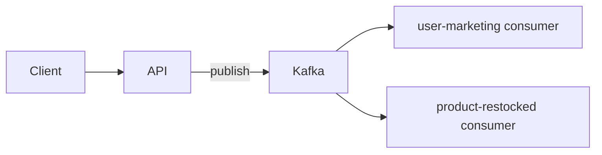
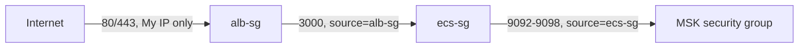

# Case study: Deploy node-modulith on AWS ECS

#infrastructure #case-study

Reference project: one TypeScript repo, one Docker image, three processes (API + two Kafka consumers). Pipeline shape: **GitHub Actions → ECR → ECS + MSK**.

**Repo:** https://github.com/vasil-sarandev/node-modulith
**Commit snapshot:** 73af16c0c7ed1e6e5e29101aadbb9d64be733ed9

---

## Overview



| Process | Command |
| --- | --- |
| API | `node dist/api/app.js` |
| user-marketing consumer | `node dist/consumers/user-marketing-consumer/index.js` |
| product-restocked consumer | `node dist/consumers/product-restocked/index.js` |

**CI/CD — GitHub Actions → ECR → ECS:**

- ECR repository `node-modulith`
- IAM OIDC provider → GitHub (`token.actions.githubusercontent.com`)
- IAM role: trust scoped to the repo; permissions cover ECR push to that repository plus `ecs:RegisterTaskDefinition`, `ecs:UpdateService`, `ecs:DescribeServices`, `ecs:DescribeTaskDefinition`, and `iam:PassRole` scoped to just `ecsTaskExecutionRole` — enough to deploy, nothing broader
- GitHub secrets: `AWS_ROLE_ARN`, `AWS_REGION`

```text
merge to main
     │
     ├─ lint + test
     ├─ docker build (runtime) → push to ECR (tagged :{git-sha} and :main)
     └─ register new task definition revision per service → update service (rolling deploy)
```

Every push to `main` produces one image, tagged both with the commit SHA (immutable, what actually gets deployed) and `main` (floating, for convenience). CI then registers a new task definition revision per service pointing at that SHA and updates the service — three independent rolling deployments off the same image. Services roll out independently: a bad deploy on one consumer doesn't block the API or the other consumer.

```text
Internet → ALB → api (ECS service)
                    ↓
              MSK ← api + 2 consumer services
```

Three ECS services, one ECR image URI, differing by `command` override + env vars. API gets the ALB; consumers have no public ingress. Consumer scale ≤ Kafka **partition count** per topic.

**Local vs production** — same process topology, different orchestration depth:

| | Local (`docker compose`) | Production (ECS) |
| --- | --- | --- |
| **Processes** | API + 2 consumers as separate compose services | Same three processes as separate ECS services |
| **Kafka** | Kafka container + `kafka-init` topic script | Amazon MSK |
| **Image** | `development` stage, bind-mounted source | `runtime` stage from ECR |
| **Reload** | `tsx watch` via volume mounts | Redeploy new image tag |
| **Config** | `environment:` in `docker-compose.yaml` | Task definition env vars |
| **HTTP** | `localhost:3000` | ALB → API tasks |
| **Deploy** | `npm run dev` | GHA → ECR push → ECS rolling update |

Compose mirrors **who talks to whom**, not production concerns (multi-AZ, IAM, health-checked rollouts). See [Docker — Local vs Production](../../../technologies/docker/docker.md).

---

## Walkthrough

Built by hand through the console, in this order, reusing an existing default VPC. General mechanics for MSK, ECS, and ALB/target groups are covered in their own pages ([MSK](../../../technologies/aws/services/msk.md), [ECS](../../../technologies/aws/services/ecs.md), [ALB](../../../technologies/aws/services/alb.md)) — this section is the concrete configuration for this specific deployment.

### 1. Security groups

SG-to-SG references, not CIDRs. Built in this order, since each one references the previous by ID:



| SG | Inbound | Source |
| --- | --- | --- |
| `alb-sg` | 80/443 | My IP |
| `ecs-sg` | container port (3000) | `alb-sg` |
| MSK SG | 9092–9098 | `ecs-sg` |

Consumers have no inbound rule at all — outbound only. Default VPC has no private subnets (all route to the IGW); no NAT Gateway needed, tasks reach ECR/CloudWatch via the IGW with `Auto-assign public IP: enabled`.

### 2. MSK cluster

Created via console. Config: Provisioned, unauthenticated + IAM client auth, plaintext + IAM listeners enabled, security group per above.

### 3. ECS cluster

Fargate, cluster name `node-modulith-cluster-1`.

### 4. IAM execution role

One shared `ecsTaskExecutionRole` (AWS-managed `AmazonECSTaskExecutionRolePolicy`) across all three task definitions — ECR pull + CloudWatch Logs write, nothing more. No task role, since none of these processes call AWS APIs directly.

### 5. Task definitions

| Task def                          | Command override                                       | Port mapping | Env                                                  |
| --------------------------------- | ------------------------------------------------------ | ------------ | ---------------------------------------------------- |
| `api-task`                        | *(none — image's default `CMD`)*                       | `3000`       | `PORT`, `NODE_ENV`, `KAFKA_BROKERS`                  |
| `user-marketing-consumer-task`    | `node,dist/consumers/user-marketing-consumer/index.js` | none         | `KAFKA_CLIENT_ID`, `KAFKA_GROUP_ID`, `KAFKA_BROKERS` |
| `product-restocked-consumer-task` | `node,dist/consumers/product-restocked/index.js`       | none         | `KAFKA_CLIENT_ID`, `KAFKA_GROUP_ID`, `KAFKA_BROKERS` |

### 6. ALB + target group

Target type IP, health check path `GET /health`.

### 7. ECS services

| Service | Task def | Desired count | Load balancer |
| --- | --- | --- | --- |
| `api` | `api-task` | 1 | ALB target group |
| `user-marketing-consumer` | `user-marketing-consumer-task` | 1 | none |
| `product-restocked-consumer` | `product-restocked-consumer-task` | 1 | none |

Env vars are set per container in the task definition (see step 5).

### 8. CI/CD

OIDC role extended with the ECS permissions listed in the Overview. Full workflow mechanics: [ECS deploy via GitHub Actions](../../../technologies/github-actions/hands-on/ecs-github-actions-deploy.md).

---

## Observability

| Layer | [CloudWatch](../../../technologies/aws/services/cloudwatch.md) (AWS-native) | Prometheus + Grafana |
| --- | --- | --- |
| **Logs** | Task `awslogs` driver → log groups per service | Scrape or ship logs separately (e.g. Loki); not the default ECS path |
| **Metrics** | ECS service CPU/memory, ALB request count & 5xx, MSK broker metrics | App + Kafka exporters; custom dashboards; **consumer lag** for scaling signals |
| **Dashboards** | CloudWatch dashboards | Grafana |
| **Alerts** | CloudWatch Alarms → SNS / on-call | Grafana alerts or Alertmanager |

**What to watch for this stack:**

- **API** — ALB target health, 5xx rate, p95 latency, ECS `RunningTaskCount` vs desired
- **Consumers** — consumer group **lag** per topic (`user-marketing-consent`, `product-restocked`); scale signals in [Autoscaling](../deployment-and-release-engineering/assets/autoscaling.md)
- **Deploys** — failed task launches, circuit breaker rollbacks

CloudWatch is the straightforward starting point on ECS (logs + built-in metrics + alarms). Prometheus + Grafana add richer app/Kafka metrics and pair well with lag-based consumer autoscaling — common when outgrowing default dashboards, but on Fargate specifically needs ECS service discovery (no static task IPs to scrape) and an EFS mount (no persistent local disk) if self-hosted; Amazon Managed Prometheus + an ADOT collector sidesteps both at the cost of a separate bill. See [Backend — Observability](../../software-engineering/backend-software-engineering/backend-software-engineering.md#observability), [System Design — Monitoring](../../software-engineering/system-design/system-design.md#monitoring).

---
