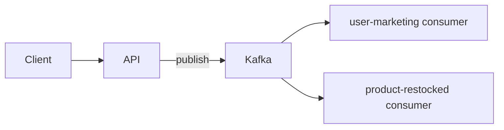

# Case study: Node-distributed-monolith on AWS ECS

#infrastructure #case-study

Reference project: one TypeScript repo, one Docker image, three processes (API + two Kafka consumers). Pipeline shape: **GitHub Actions → ECR → ECS + MSK**.

**Repo:** [node-distributed-monolith-starter](https://github.com/vasil-sarandev/node-distributed-monolith-starter) [commit snapshot](https://github.com/vasil-sarandev/node-distributed-monolith/commit/31b0ebaf536eb2b8331f0ba1f9a88d69f635051a)

---

## App shape



| Process | Command |
| --- | --- |
| API | `node dist/api/app.js` |
| user-marketing consumer | `node dist/consumers/user-marketing-consumer/index.js` |
| product-restocked consumer | `node dist/consumers/product-restocked/index.js` |

---

## Local vs production

Same process topology; different orchestration and ops depth.

| | Local (`docker compose`) | Production (ECS) |
| --- | --- | --- |
| **Processes** | API + 2 consumers as separate compose services | Same three processes as separate ECS services |
| **Kafka** | Kafka container + `kafka-init` topic script | Amazon MSK |
| **Image** | `development` stage, bind-mounted source | `runtime` stage from ECR |
| **Reload** | `tsx watch` via volume mounts | Redeploy new image tag |
| **Config** | `environment:` in `docker-compose.yaml` | Task definition env + SSM / Secrets Manager |
| **HTTP** | `localhost:3000` | ALB → API tasks in private subnets |
| **Deploy** | `npm run dev` | GHA → ECR push → ECS rolling update |
| **Observability** | Docker logs to terminal | CloudWatch Logs + metrics; optional Prometheus + Grafana |

Compose mirrors **who talks to whom**, not production concerns (multi-AZ, autoscaling, IAM, health-checked rollouts). See [Docker — Local vs Production](../../../../technologies/docker/docker.md).

---

## Full pipeline

```text
merge to main
     │
     ├─ lint + test
     ├─ docker build (runtime) → push to ECR  (:git-sha)
     └─ register task defs → update ECS services  (rolling deploy)
```

ECR stores the artifact; ECS runs it. Pushing an image does not start workloads — something must point ECS at the new tag.

```text
Internet → ALB → api (ECS service)
                    ↓
              MSK ← api + 2 consumer services
```

Three ECS services, one ECR image URI. API gets the ALB; consumers have no public ingress. Consumer scale ≤ Kafka **partition count** per topic.

---

## CI: push to ECR (OIDC)

**AWS (once per account/repo):**

- ECR repository `node-distributed-monolith`
- IAM OIDC provider → GitHub (`token.actions.githubusercontent.com`)
- IAM role: trust scoped to the repo; policy allows ECR push to that repository only

**GitHub secrets:** `AWS_ROLE_ARN`, `AWS_REGION`

**Workflow on `main`:** `configure-aws-credentials` (OIDC, `id-token: write`) → `amazon-ecr-login` → `docker build --target runtime` → push `.../node-distributed-monolith:{git-sha}`

---

## Production: ECS

**Infra:** VPC, MSK (topics `user-marketing-consent`, `product-restocked`), Fargate cluster, ALB → API, three task definitions / three services.

Each task definition shares the same `image` field; differs on `command`, env, CPU/RAM. Env at runtime (`KAFKA_BROKERS`, consumer group IDs, `PORT`) — not baked into the image. Task execution role pulls from ECR and writes logs.

**Deploy job:** extend the GitHub OIDC role with `ecs:RegisterTaskDefinition`, `ecs:UpdateService`, `iam:PassRole`. After each image push, register a new task definition revision per service (new tag), then `update-service --force-new-deployment`. Services roll out independently.

---

## Observability

| Layer | [CloudWatch](../../../../technologies/aws/services/cloudwatch.md) (AWS-native) | Prometheus + Grafana |
| --- | --- | --- |
| **Logs** | Task `awslogs` driver → log groups per service | Scrape or ship logs separately (e.g. Loki); not the default ECS path |
| **Metrics** | ECS service CPU/memory, ALB request count & 5xx, MSK broker metrics | App + Kafka exporters; custom dashboards; **consumer lag** for scaling signals |
| **Dashboards** | CloudWatch dashboards | Grafana |
| **Alerts** | CloudWatch Alarms → SNS / on-call | Grafana alerts or Alertmanager |

**What to watch for this stack:**

- **API** — ALB target health, 5xx rate, p95 latency, ECS `RunningTaskCount` vs desired
- **Consumers** — consumer group **lag** per topic (`user-marketing-consent`, `product-restocked`); scale signals in [Autoscaling](../deployment-and-release-engineering/assets/autoscaling.md)
- **Deploys** — failed task launches, circuit breaker rollbacks

CloudWatch is the straightforward starting point on ECS (logs + built-in metrics + alarms). Prometheus + Grafana add richer app/Kafka metrics and pair well with lag-based consumer autoscaling — common when outgrowing default dashboards. See [Backend — Observability](../../software-engineering/backend-software-engineering/backend-software-engineering.md#observability), [System Design — Monitoring](../../software-engineering/system-design/system-design.md#monitoring).

---
