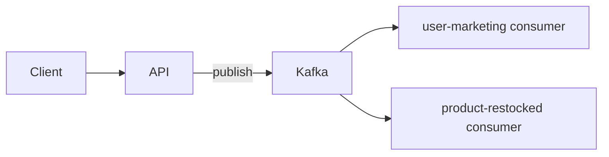
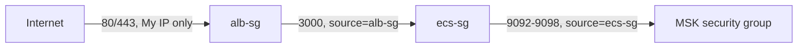

# Case study: Node-modulith on AWS ECS

#infrastructure #case-study

Reference project: one TypeScript repo, one Docker image, three processes (API + two Kafka consumers). Pipeline shape: **GitHub Actions → ECR → ECS + MSK**.

**Repo:** https://github.com/vasil-sarandev/node-modulith
**Commit snapshot:** 1aac704de82b07ce60dda24a06a6ce4d1d54f952

---

## Overview



| Process | Command |
| --- | --- |
| API | `node dist/api/app.js` |
| user-marketing consumer | `node dist/consumers/user-marketing-consumer/index.js` |
| product-restocked consumer | `node dist/consumers/product-restocked/index.js` |

**CI/CD — GitHub Actions → ECR → ECS:**

- ECR repository `node-modulith`
- IAM OIDC provider → GitHub (`token.actions.githubusercontent.com`)
- IAM role: trust scoped to the repo; permissions cover ECR push to that repository plus `ecs:RegisterTaskDefinition`, `ecs:UpdateService`, `ecs:DescribeServices`, `ecs:DescribeTaskDefinition`, and `iam:PassRole` scoped to just `ecsTaskExecutionRole` — enough to deploy, nothing broader
- GitHub secrets: `AWS_ROLE_ARN`, `AWS_REGION`

```text
merge to main
     │
     ├─ lint + test
     ├─ docker build (runtime) → push to ECR (tagged :{git-sha} and :main)
     └─ register new task definition revision per service → update service (rolling deploy)
```

Every push to `main` produces one image, tagged both with the commit SHA (immutable, what actually gets deployed) and `main` (floating, for convenience). CI then registers a new task definition revision per service pointing at that SHA and updates the service — three independent rolling deployments off the same image. Services roll out independently: a bad deploy on one consumer doesn't block the API or the other consumer.

```text
Internet → ALB → api (ECS service)
                    ↓
              MSK ← api + 2 consumer services
```

Three ECS services, one ECR image URI, differing by `command` override + env vars. API gets the ALB; consumers have no public ingress. Consumer scale ≤ Kafka **partition count** per topic.

**Local vs production** — same process topology, different orchestration depth:

| | Local (`docker compose`) | Production (ECS) |
| --- | --- | --- |
| **Processes** | API + 2 consumers as separate compose services | Same three processes as separate ECS services |
| **Kafka** | Kafka container + `kafka-init` topic script | Amazon MSK |
| **Image** | `development` stage, bind-mounted source | `runtime` stage from ECR |
| **Reload** | `tsx watch` via volume mounts | Redeploy new image tag |
| **Config** | `environment:` in `docker-compose.yaml` | Task definition env vars |
| **HTTP** | `localhost:3000` | ALB → API tasks |
| **Deploy** | `npm run dev` | GHA → ECR push → ECS rolling update |

Compose mirrors **who talks to whom**, not production concerns (multi-AZ, IAM, health-checked rollouts). See [Docker — Local vs Production](../../../../technologies/docker/docker.md).

---

## Walkthrough

Built by hand through the console, in this order. Reused an existing default VPC rather than provisioning a new one.

### 1. Security groups

SG-to-SG references, not CIDRs — each rule says who's allowed in by security group, not IP range. Built in this order since each one references the previous by ID:



- `alb-sg`: inbound 80/443, source **My IP** (not `0.0.0.0/0` — no reason to expose a personal test stack to the internet)
- `ecs-sg`: inbound on the container port, source = `alb-sg`. Consumers need **no inbound rule at all** — outbound only, nothing calls them.
- MSK's security group: inbound 9092–9098, source = `ecs-sg`

**Default VPC quirk hit here:** every subnet in a default VPC already routes to an Internet Gateway — there's no private subnet to place anything in. Not a security problem by itself (security groups still gate access; subnet routing only controls internet reachability), and it has a nice side effect: no NAT Gateway needed at all. ECS tasks reach ECR/CloudWatch straight through the IGW as long as they get a public IP (`Auto-assign public IP: enabled` on the service).

### 2. MSK cluster

Created via the console. Two things that only showed up once actually in it:

- **The cluster's VPC security group is fixed at creation** and can't be swapped afterward — the "Edit" action on Networking settings only covers public-access and multi-VPC-connectivity toggles, nothing for reattaching a different SG. Fix: add the needed inbound rule to whichever SG is already attached (ended up being the default SG here) instead of fighting to move to a purpose-named one.
- **"Quick create" defaults to IAM authentication only** — no plaintext (9092) or TLS (9094) listener, just SASL/IAM on 9098. Using that would mean wiring `aws-msk-iam-sasl-signer-js` into `kafkajs`, plus a task role with `kafka-cluster:Connect`/`DescribeTopic`/`ReadData`/`WriteData` permissions. Simpler path taken here: cluster → Edit/Delete menu → **"Edit security settings"** (a separate, genuinely-editable action, unlike the locked SG) → add unauthenticated access alongside IAM → plaintext endpoint appears, zero app code changes needed.

**Topics:** no MSK equivalent of the local `kafka-init` container — created instead from a throwaway EC2 instance in a public subnet, reached via SSM Session Manager (no SSH keys, no inbound port 22 anywhere), with Java + the Kafka CLI installed, running `scripts/kafka/create-topics.sh` against the real bootstrap servers.

### 3. ECS cluster

Fargate, no EC2 capacity to manage. First attempt failed: `Unable to assume the service linked role` — `AWSServiceRoleForECS` hadn't been auto-created yet in this account (first ECS action ever taken in it). A retry succeeded; also fixable explicitly via `aws iam create-service-linked-role --aws-service-name ecs.amazonaws.com`.

### 4. IAM execution role

One shared `ecsTaskExecutionRole` (AWS-managed `AmazonECSTaskExecutionRolePolicy`) across all three task definitions — covers ECR pull + CloudWatch Logs write, nothing more. No task role needed, since none of these processes call AWS APIs directly.

### 5. Task definitions

| Task def | Command override | Port mapping | Env |
| --- | --- | --- | --- |
| `api-task` | *(none — image's default `CMD`)* | `3000` | `PORT`, `NODE_ENV`, `KAFKA_BROKERS` |
| `user-marketing-consumer-task` | `node,dist/consumers/user-marketing-consumer/index.js` | none | `KAFKA_CLIENT_ID`, `KAFKA_GROUP_ID`, `KAFKA_BROKERS` |
| `product-restocked-consumer-task` | `node,dist/consumers/product-restocked/index.js` | none | `KAFKA_CLIENT_ID`, `KAFKA_GROUP_ID`, `KAFKA_BROKERS` |

Command override syntax in the console is comma-separated, no spaces (`node,dist/...`) — each piece becomes one array element, same idea as Docker's exec-form `CMD`. The field lives in a collapsed **"Docker configuration"** section, not near the environment-variables list — "Configure via JSON" at the top of the task-def page is a more reliable way in if the form layout is hard to find.

Don't trust a docs table for a process's env contract — grepped `process.env` per process instead of assuming. Caught: the consumers don't read a `KAFKA_TOPIC` env var at all (topic is hardcoded via the `Topics` enum in code), and they do read `KAFKA_CLIENT_ID`, which wasn't documented anywhere. `docs/deployment.md` had drifted from the actual code and got corrected as part of this exercise.

### 6. ALB + target group

- Lives under the EC2 console despite nothing here running on EC2 — Elastic Load Balancing predates ECS/Fargate, AWS just never moved it. Its IAM actions are `elasticloadbalancing:*`, unrelated to `ec2:*`.
- Target group type: **IP**, not Instance — required for Fargate's `awsvpc` networking to route to a task's ENI directly.
- Skip "register targets" in the target-group wizard entirely — ECS registers/deregisters real task IPs automatically once the service references the target group; anything typed in by hand would just be stale.
- Health check path defaults to `/` in the wizard. This app had no health route at all — `GET /health` was added to `appRouter` before the target group could report healthy.
- With desired count = 1, this isn't really "load balancing" in the traditional sense. Its actual value here: a stable DNS name across Fargate's ephemeral per-restart task IPs, and health-check-gated rolling deploys (new task must pass its health check before the old one drains) instead of a hard cutover.

### 7. ECS services

Three services, one per task definition: `api` attached to the ALB target group; `user-marketing-consumer` and `product-restocked-consumer` with no load balancer. `KAFKA_BROKERS` points at the MSK plaintext bootstrap string unlocked in step 2.

### 8. CI/CD

OIDC role extended with the ECS permissions listed in the Overview. Workflow addition after the image push: for each service, pull its current task definition, render the new image tag into it, register the revision, and update the service — three independent rolling deployments per push to `main`.

---

## Observability

| Layer | [CloudWatch](../../../../technologies/aws/services/cloudwatch.md) (AWS-native) | Prometheus + Grafana |
| --- | --- | --- |
| **Logs** | Task `awslogs` driver → log groups per service | Scrape or ship logs separately (e.g. Loki); not the default ECS path |
| **Metrics** | ECS service CPU/memory, ALB request count & 5xx, MSK broker metrics | App + Kafka exporters; custom dashboards; **consumer lag** for scaling signals |
| **Dashboards** | CloudWatch dashboards | Grafana |
| **Alerts** | CloudWatch Alarms → SNS / on-call | Grafana alerts or Alertmanager |

**What to watch for this stack:**

- **API** — ALB target health, 5xx rate, p95 latency, ECS `RunningTaskCount` vs desired
- **Consumers** — consumer group **lag** per topic (`user-marketing-consent`, `product-restocked`); scale signals in [Autoscaling](../deployment-and-release-engineering/assets/autoscaling.md)
- **Deploys** — failed task launches, circuit breaker rollbacks

CloudWatch is the straightforward starting point on ECS (logs + built-in metrics + alarms). Prometheus + Grafana add richer app/Kafka metrics and pair well with lag-based consumer autoscaling — common when outgrowing default dashboards, but on Fargate specifically needs ECS service discovery (no static task IPs to scrape) and an EFS mount (no persistent local disk) if self-hosted; Amazon Managed Prometheus + an ADOT collector sidesteps both at the cost of a separate bill. See [Backend — Observability](../../software-engineering/backend-software-engineering/backend-software-engineering.md#observability), [System Design — Monitoring](../../software-engineering/system-design/system-design.md#monitoring).

---
