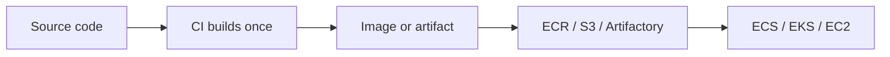

# Deployment & Release Engineering

#infrastructure

How software is **built once**, **shipped** as an immutable artifact, and **run** in production — plus strategies for releasing safely and recovering when things go wrong.

Concept notes live here; tool-specific details stay under [technologies](../../../../technologies/docker/docker.md).

---
## Resources

- **Deep Dives**
	- [Deployment Strategies](assets/deployment-strategies.md)
	- [Feature Flags](assets/feature-flags.md)
	- [Rollbacks](assets/rollbacks.md)

- **Learning roadmap**
	- [Infrastructure Hands On](../infrastructure-hands-on/infrastructure-hands-on.md) — hands-on projects (ECS, EKS, Terraform)

- **Related technologies**
	- [Docker](../../../../technologies/docker/docker.md) — images, compose, local vs prod
	- [GitHub Actions](../../../../technologies/github-actions/github-actions.md) — CI build and push
	- [Amazon ECR](ecr.md) — image registry
	- [Amazon ECS](ecs.md) / [EKS](eks.md) — run containers in prod

---
## Core pipeline

Every serious deployment follows the same shape — only the **artifact type** changes:

| Path | Build output | Storage | Deploy |
|------|--------------|---------|--------|
| **Containers** | Docker image | [ECR](ecr.md) | ECS / EKS pulls tag, starts tasks/pods |
| **Traditional** | JAR, tarball, binary | S3, Nexus | Copy to EC2, restart via systemd / CodeDeploy |

CI never runs `git pull && npm install` on production servers. Production always runs a **known built thing**.

See [Deployment Strategies](assets/deployment-strategies.md) for rolling, blue/green, and canary releases.

---
## Local vs production

| | Local (compose) | Production |
|---|-----------------|------------|
| **Purpose** | Dev + integration testing | Run and operate services |
| **Orchestration** | `docker compose up` | ECS, EKS, etc. |
| **Image** | Often `development` stage + volume mounts | `runtime` image from registry |
| **Config** | `env_file`, compose env | Secrets Manager, SSM, K8s Secrets |

Compose mirrors **service topology** (API + workers + Kafka + DB), not operational depth (autoscaling, multi-AZ, IAM). See [Docker — Local vs Production](../../../../technologies/docker/docker.md#local-vs-production).

---
## Release safety

Releasing != deploying. Safe releases combine:

| Technique | Purpose |
|-----------|---------|
| [Deployment strategies](assets/deployment-strategies.md) | Limit blast radius during rollout (rolling, blue/green, canary) |
| [Feature flags](assets/feature-flags.md) | Decouple deploy from exposure — ship code dark, enable gradually |
| [Rollbacks](assets/rollbacks.md) | Recover quickly when a bad version reaches prod |

---

## One image, many services

A **distributed monolith** often builds **one image** and runs it as separate processes:

- API: `node dist/api/app.js`
- Consumer A: `node dist/consumers/foo/app.js`
- Consumer B: `node dist/consumers/bar/app.js`

Same ECR tag; different `command` per ECS service or K8s Deployment. Deploy and scale each independently.

---
