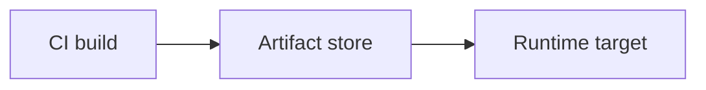

# Deployment targets

#infrastructure

**Where** production workloads run — the compute or hosting layer you deploy _to_. Distinct from [rollout strategies](../deployment-and-release-engineering/assets/deployment-strategies.md) (rolling, blue/green, canary), which describe _how_ a new version replaces the old one on any target.

All paths follow the same pipeline: **CI builds once → artifact stored → runtime pulls and runs it**. Only the artifact type and orchestrator change.

Parent hub: [Infrastructure](../infrastructure.md).

---

## Guides

- [Deploy to EC2](ec2.md) — JARs, binaries, systemd, CodeDeploy, ASG + ALB, **or Docker via SSM Run Command**
- [Deploy to ECS](ecs.md) — Docker on Fargate, ECR, task definitions, services
- [Deploy to EKS](eks.md) — Kubernetes Deployments, Helm, GitOps
- [Deploy static SPA to S3](s3-static-spa.md) — frontend build → S3 + CloudFront

---

## Overview

| Target        | Best for                                     | Artifact                                 | Typical store                                                        | Deploy trigger                                                                                                    |
| ------------- | -------------------------------------------- | ---------------------------------------- | -------------------------------------------------------------------- | ----------------------------------------------------------------------------------------------------------------- |
| EC2           | Full VM control — containerized or not       | JAR, binary, tarball **or** Docker image | S3, Artifactory, or [ECR](../../../technologies/aws/services/ecr.md) | Copy + restart, CodeDeploy, ASG refresh, or [SSM Run Command](../../../technologies/aws/services/ssm.md) (Docker) |
| ECS           | Containerized apps on AWS without Kubernetes | Docker image                             | [ECR](../../../technologies/aws/services/ecr.md)                     | New task definition → `update-service`                                                                            |
| EKS           | Containerized apps on Kubernetes             | Docker image                             | ECR                                                                  | `kubectl` / Helm / GitOps sync                                                                                    |
| S3 static SPA | Frontend SPAs (React, Vue, etc.)             | `dist/` static files                     | S3 (+ CloudFront)                                                    | `aws s3 sync` / invalidate CDN                                                                                    |

Service reference (IAM, networking, scaling): [Amazon Web Services](../../../technologies/aws/aws.md), [Kubernetes](../../../technologies/kubernetes/kubernetes.md).

---

## Choosing a target

| Situation                                                                         | Lean toward                                                                    |
| --------------------------------------------------------------------------------- | ------------------------------------------------------------------------------ |
| Spring Boot JAR, no containers yet                                                | [EC2](ec2.md) (+ ASG + ALB) or containerize later                              |
| Node/Go API in Docker, AWS-native ops                                             | [ECS](ecs.md) Fargate                                                          |
| Docker app, want full VM control, single instance is fine, no orchestrator needed | [EC2](ec2.md) + Docker via SSM Run Command                                     |
| Team standard is Helm + K8s operators                                             | [EKS](eks.md)                                                                  |
| React/Vite SPA, API elsewhere                                                     | [S3 static SPA](s3-static-spa.md)                                              |
| One image, API + workers (distributed monolith)                                   | [ECS](ecs.md) or [EKS](eks.md) — multiple services/Deployments, same image tag |

Case Studies:

- [ECS + Kafka (node-modulith)](../case-studies/deploy-to-ecs-node-modulith.md)

- [Docker on EC2 via SSM (showtimex)](../case-studies/deploy-to-ec2-docker-showtimex.md).
  e-engineering.md)
